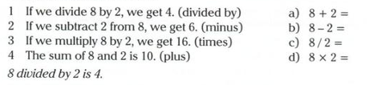

# Administration

## pg 28

### 2

1. C
2. B
3. D
4. A

### 4

1. F
   Cell - Celda
2. E
   Column - Columna
3. A
   Formula - Formula
4. B
   Row - Filas
5. C
   Value - Valor
6. D
   Worksheet - Hoja de calculo

## pg 29

### 7 and 8

| Action                                | Problem                                          | Solucion                                                                      |
| ------------------------------------- | ------------------------------------------------ | ----------------------------------------------------------------------------- |
| 1. typed in a formula                 | get an error message                             | b) misspelt (malescrito) the function in the formula                          |
| 2. saved in main folder               | can't find the spreadsheet                       | a) saved in another folder by mistake                                         |
| 3. Designed a spreadsheet to work out | it doesn't work                                  | d) chose the wrong formula                                                    |
| 4. typed a date into cell             | it shows a number instead(en ves de \_ al final) | c) need to right-click on the cell, select 'Format cells', then select 'Date' |

## pg 30

### 2

2 table - C

1 report - B

3 form - A

### 3

a) clients and orders

## vocabulary

|                    | Definicion                 |
| ------------------ | -------------------------- |
| Fields             | campo                      |
| Form               | formulario                 |
| Objects            | objetos                    |
| Primary key        | clave primaria             |
| query the database | consultar la base de datos |
| record             | registro                   |
| report             | reporte                    |
| retrieve a record  | pedir un registro          |
| unique             | Unico dobber               |

## pg 31

### 5

1. Membership number it is unique to them
2. Barcode it identifies the product
3. Noational identity card number or case number

### gramar

by + -ing

we can use by + -ing to express how to do things
ex.

- we can find the totatl number of hours **by querying** the database
- **by running** a report, we can print a list of customers

### 8

1. by querying the database
2. by adding a sum formula into a spreadsheet
3. by using a primary key
4. by running a report

# System administrator

## pg 32

### 1

| a systems administrator's task                    | not a a systems administrator's task      |
| ------------------------------------------------- | ----------------------------------------- |
| deploys new software                              | designs databases                         |
| `looks after`(cuidar/supervisar) network security | work on a help desk                       |
| Setup user accounts                               | write software to sell to other companies |
| updates software across an organisation           |                                           |

### 3

no its a big company cuase it has many departments

### 4

|                                     | Worked fine | Problem found | Not mentioned |
| ----------------------------------- | ----------- | ------------- | ------------- |
| 1 deploys new software Upgrades     | ✓           |               |               |
| 2 deploys new software applications |             |               | ✓             |
| 3 backup systems                    | ✓           |               |               |
| 4 disk drives                       |             | ✓             |               |
| 5 set permissions                   | ✓           |               |               |
| 6 check logs                        |             | ✓             |               |
| 7 reset passwords                   |             | ✓             |               |

### 5

    deploy - logs - reset - permissions

1. data that a program or computer produces while it runs, to shows how well it is working \_ logs
2. Install on many computers at the same times \_ deploy
3. Change, set again \_ reset
4. Settings on a computer, file o folder that say who can use them \_ permissions

# System administration

## pg 32

### 6

| A                    | B                | translation                              |
| -------------------- | ---------------- | ---------------------------------------- |
| 1. Check (something) | a. smoothly      | 1 --> b Revisar algo                     |
| 2. run               | b. out           | 2 --> a Funciona bien                    |
| 3. go                | c. out of        | 3 --> f Ir bien                          |
| 4. disk              | d. running again | 4 --> d Fallo de disco                   |
| 5. lock (someone)    | e.crash          | 5 --> c bloquear acceso a alguien        |
| 6. be up and         | f. smoothly      | 6 --> d funciona de nuevo con normalidad |

## 33

### While, Before, After

| Definition                                                                                                      | Example                                                                                                             |
| --------------------------------------------------------------------------------------------------------------- | ------------------------------------------------------------------------------------------------------------------- |
| We can use while, before and after to show the order of events.                                                 | While you install the OS, the computer will ask you some questions. 
| | Before you reinstall the OS, back everything up |
| if the same person is doing the action in both clauses, we can use the -ing form of the verb after these words. | After resetting the password, log in to check that the new one works.                                               |

 
### 7 
1. While you install an OS, the computer may reboot several times
2. Before deploying major software system upgrades, train the users
3. After replacing the hard drive, everything will go smoothly
4. After forgetting the password, reset it 

### 10
1. Before finishing work for the day, check the logs, 
2. Before starting work tomorrow, check out the db problem
3. While you being in the server room check the wetwerk cabled
4. After the new designer arrives set permissions on this computer

## Peripherals
### vocabulary
1. NAS _ A
2. toghscreen _ B
3. headset _ C
4. touchpad _ D
5. graphic tablet and stylus _ E
6. Stylus _ F
7. multifunctional printer _ G
8. projector _ H

## Language
1. I was printing some documentation whe the printer had a paper jam
2. I was listening the podcast with headset when the sound stopped
3. While i was using graphic tablet i moved stylus but the cursor didn't move
4. The light stopped working while i was using the projector

## Bussines matters
| Problem | Action |
|--|--|
| Hard drive crashed | replace it |
| want a new report | create it |
| several dropouts | check server |
| backup system failed | restart it |
| locked out | reset password |
| wrong cables | change cables |

